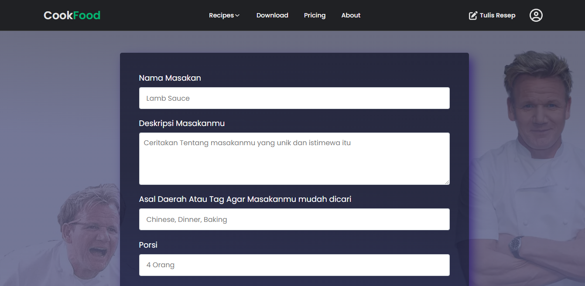
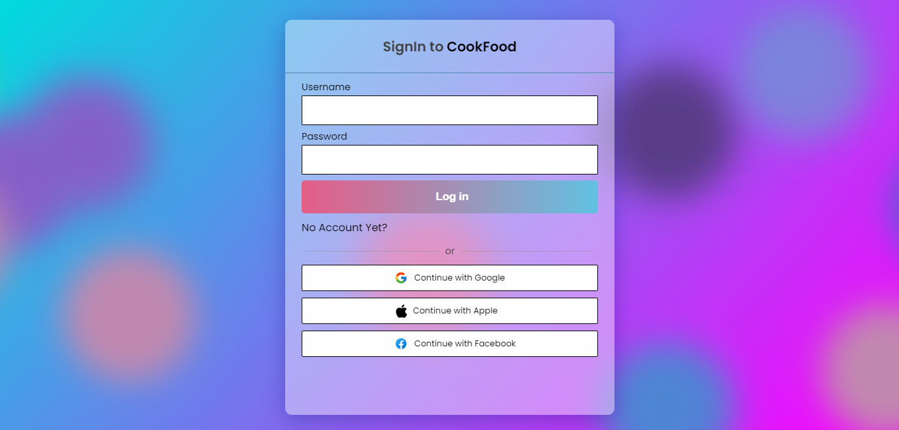

# [Cookfood : Mau Masak Apa Hari Ini](https://project.nubisub.xyz/)

 bruh

CookFood merupakan website untuk menyimpan dan membagikan resep makanan atau minuman yang dibuat oleh pengguna. Pembuatan website ini terinspirasi secara tidak sengaja dari [YouTube recomendation](https://www.youtube.com/watch?v=xc4uOzlndAk&ab_channel=DevEd) , tetapi dalam tutorial tersebut menggunakan reactJS dan API dari [Spoonacular](https://spoonacular.com/) sedangkan dalam pembuatan website ini menggunakan HTML, CSS, JavaScript, PHP dan penyimpanan database menggunakan MySQL.

## Client Requirement

- [x] No Framework :(
- [x] CRUD
- [x] Minimum 10 dummy data
- [x] Search + Suggestion
- [x] SQL injection prevention
- [x] W3C Validator
- [x] JSHint
- [x] Homepage
- [x] Table
- [x] Form

## Menu/Fitur tersedia (Deadline Pertama)

- [x] Home Page
- [x] Write Recipe
- [x] Explore Menu
- [x] Pricing
- [x] Login & Signup Page
- [x] Dark Mode
- [x] Open Graph Protocol

## Menu/Fitur tersedia (Deadline Final)
- [x] Sign in
- [x] Sign up
- [x] Sign out
- [x] Create Recipe
- [x] Read (all or just user's recipe)
- [X] Update Recipe
- [x] Delete Recipe
- [X] Search Recipe with suggestion, with debounce
- [X] Visibility Recipe (Public or Private)

## Inspirasi Style & UI/UX

- [Netlify](https://www.netlify.com/)
- [Airbnb](https://www.airbnb.com/)
- [UI/UX from dribble](https://dribbble.com/shots/15223754/attachments/6970440?mode=media)
- [Sign in Modal Box](https://dribbble.com/shots/3775046-Updated-Login-Modal-Window)
- [Cookpad](https://cookpad.com/id)
- [Algolia](https://www.algolia.com/)

## Inspirasi Code

- [Searchbar](https://codepen.io/kmuenster/pen/XWWeQGw)
- [Dropdown](https://codepen.io/daddasoft/pen/MWrYQYe)
- [Shadow when Scroll](https://stackoverflow.com/questions/40967682/navbar-changing-to-add-shadow-on-scroll)
- [outside element click](https://codepen.io/blustemy/pen/QdjXaO)
- [outside element click](https://codepen.io/sean_smyth/pen/Lmyama)

## Font & Icon

- [Google Font](https://fonts.google.com/)
- [Font Awesome](https://fontawesome.com/)
- [Favicon Generator](https://www.favicon-generator.org/)

## Tools & Design

- Photoshop
- [CSS Shadow Generator](https://cssgenerator.org/box-shadow-css-generator.html)
- [CSS Gradient Background Generator](https://cssgradient.io/)
- [Glassmorphism Generator](https://hype4.academy/tools/glassmorphism-generator)
- [webp conversion and compression](https://ezgif.com/png-to-webp)
- [UglifyJS](https://www.npmjs.com/package/uglify-js)
- [clean-css](https://www.npmjs.com/package/clean-css)
- [Open Graph Meta Tags Generator](https://www.opengraph.xyz/)

## Dokumentasi

Made with :kiss: 

 
Keep It Simple Stupid

